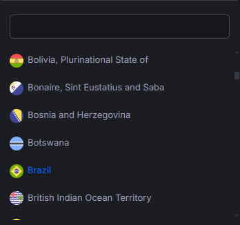
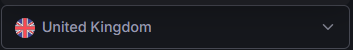

<p align="center">
    
    <p align="center">
        <a href="https://packagist.org/packages/gsferro/select2easy"></a>
        <a href="https://packagist.org/packages/gsferro/select2easy"></a>
        <a href="https://packagist.org/packages/gsferro/select2easy"></a>
    </p>
</p>

------
## Pacotes Dependências:
Package | Versão
--------|-----------
Jquery | ^3.*
Select2 | ^4.0.13

## Instalação

1. Instalar o pacote via Composer:
    ```shell 
    composer require gsferro/select2easy -W
    ```

2. Publicar o pacote:
    ```composer 
    php artisan vendor:publish --provider="Gsferro\Select2Easy\Providers\Select2EasyServiceProvider" --force
    ```

## Configuração
- Diretrivas blade, Coloque as no seu arquivo de layout
  - No final do header: 
    ``` php
    @select2easyCss()
    ```
  - No final do body: 
    ``` php
    @select2easyCss()
    ```

- Caso utilize framework `bootstrap 5`, adicione no header abaixo do `@select2easyCss()`:
  ``` php
  @select2easyThemeBootstrap5()
  ```
  - Mude ou na instancia do plugin ou diretamente no `public/vendor/select2easy/js/select2easy.js`:
     ``` javascript
        $('#exemple').select2easy({
         theme: 'bootstrap-5',
       });
    ```
    - Ou vc pode utilizar o `@select2easyOptionsJs()` para configurar o plugin para usar o `theme` e também já deixara 
      utilizando via `modal` ou outro `parent`,  basta adicionar antes `select2easyJs()`
    
  - É necesário fazer um ajuste no css para quando o select2 estiver `disabled` e no tamanho do `input`
    ``` php
    @select2easyThemeBootstrap5Disabled()
    ```
  - Caso queira implementar um css avançado no `theme`, adicione:  
    ``` php
    @select2easyThemeBootstrap5Advance()
    ```
- Caso você queira aplicar a instância do plugin `select2` em todas as tags `select`, adicione após `select2easyJs()`:
     ``` php
    @select2easyApplyAnyJs()
     ```
## Implementação

- Você pode implementar quantos metodos quiser, para chamar a modelo em varias ocaciões dentro do projeto
    - Ex: Model User
    - `sl2Nome`: usando o nome como busca
    - `sl2Email`: usando o nome como busca
    - `sl2Login`: usando o nome como login

- Implemente na model a trait Select2Easy
- Crie uma stact function `Sl2<NomeMetodo>` que sera chamado na implementação em `data-sl2_method` ou `{ sl2_method : ""}`

- Na View:
    - no select coloque a class select2Easy (required)
    * coloque o attributo data-sl2_method = "nomeDoMetodoEstaticoDaModel" 
    * coloque o attributo data-sl2_model = 'caminho\para\Model'
    *  ou coloque o attributo data-sl2_hash = "{{ Crypt::encryptString('caminho\para\Model') }}"
    - Exemplo:
      ```html
      <label for="select2easy">Select2 Easy:</label>
      <select id="select2easy" name="select2easy" class="form-control select2easy"
          data-sl2_method="sl2"
          data-sl2_hash="{{ Crypt::encryptString('App\Models\Teams') }}" <!-- recommend -->
          <!-- ou -->
          data-sl2_model="App\Models\Teams"

          data-minimumInputLength=2
          data-delay=1000
      >
      </select>
      ```

- Instancie o plugin no select2easy
    ``` javascript    
    <script type="text/javascript">
        $( function() {
            $( '#select2easy' ).select2easy( {
                // select2
                // minimumInputLength : 2 ,
    
                // ajax
                // delay : 1000 ,
    
                // select2eay server side
                // sl2_method : 'string Method' ,
                // sl2_hash   : 'Crypt::encryptString('App\Models\Teams')' , // recommend
                
                // ou
                // sl2_model : 'App\Models\Teams' ,
            } );
        } )
    </script>
    ```
- Model
    * Import usando: ```use Gsferro\Select2Easy\Http\Traits\Select2Easy```
    * Coloque  a trait ```Select2Easy```
    * crie o `nomeDoMetodoEstaticoDaModel` passando o term e page
    - Exemplo:
      ``` php
      <?php
        use Gsferro\Select2Easy\Http\Traits\Select2Easy

        class Teams extends Model
        {
          use Select2Easy;

          public static function sl2Name(string $term, int $page, string $parentId = null ) // nome usado na view
          {
              /*
              |---------------------------------------------------
              | Required
              |---------------------------------------------------
              |
              | $select2Search - colum from search
              | $select2Text - colum from write selectbox
              |
              */
              $select2Search = [
                  "name",
                  // with relation
                  'relation.title'
              ];

              // required
              $select2Text = "name";

              /*
              |---------------------------------------------------
              | Optional exemple
              |---------------------------------------------------
              |
              | $limitPage - limit view selectbox, default 6
              | $extraScopes - array with scopes
              | $prefix - prefix for after $select2Text
              | $scopeParentAndId - array with scope parent and id
              |
              */
              $limitPage   = 10; // default 6
              $extraScopes = ["active"] // scope previously declared 
              $prefix      = 'otherRelation.description'; //  or other column
              $scopeParentAndId = [
                'scope' => $parentId,
              ];
              $suffix = 'otherRelation.description'; //  or other column

             return self::select2easy(
                $term,
                $page,
                $select2Search,
                $select2Text,
                $limitPage = 6,
                $extraScopes = [],
                $prefix = null,
                $scopeParentAndId,
                $suffix = null,
            );
          }
      }
      ```

## Cascade (select2 parents/dependent)

Tem momentos que é necessário que um select seja dependente de outro para poder exibir os dados pré filtrados, por 
exemplo `Estado > Cidades`. Para tal, basta colocar o atributo `data-sl2_child` no select2 `pai` (*parent*) o 
`id` do select2 do`filho` (*child*):
  - Exemplo:
    ```html
    <select id="parent"
        ...
        data-sl2_child="#children" 
    >
    </select>
    ```
  - Na model: É necessário ter o scope do `pai` e ser inicializado o array `$scopeParentAndId` contendo como chave o 
    scope e o value o paramentro `$parentId`, e passar para o  `self::select2easy`, exemplo:
     ```php
    public static function sl2Name(string $term, int $page, string $parentId)
    {
        $select2Search = [
        "name",
        ];
        $select2Text = "name";
        $scopeParentAndId = [
            'parent' => $parentId,
        ];

        return self::select2easy(
            $term,
            $page,
            $select2Search,
            $select2Text,
            $limitPage = 6,
            $extraScopes = [],
            $prefix = null,
            $scopeParentAndId,
            $suffix = null,
        );
    }
    ```

    - Caso vc esteja usando as versões do `php` >8, pode utilizar o `Named Arguments`:
       ```php
      public static function sl2Name(string $term, int $page, string $parentId)
      {
          $select2Search = [
          "name",
          ];
          $select2Text = "name";
          $scopeParentAndId = [
              'parent' => $parentId,
          ];

          return self::select2easy(
              term: $term,
              page: $page,
              select2Search: $select2Search,
              select2Text: $select2Text,
              scopeParentAndId: $scopeParentAndId
          );
      }
      ```

    - Inspirado neste javascript [select2-cascade.js](https://gist.github.com/ajaxray/187e7c9a00666a7ffff52a8a69b8bf31) 

## Prefixos e Sufixos  (pode ser um relacionamento ou coluna)

- Prefixo: adicionado antes do texto do select2
- Sufixo: adicionado depois do texto do select2

## Use Templating (Markups)

- O pacote `select2easy` esta preparado para utilizar o recurso de `Templating`, que permite formatar o 
  título (`text`) e o html exibido no plugin `select2`. 
- Para isso, basta criar na model os metodos tanto para o `text` quanto para o  `html`, e o plugin fará o resto. 
- O `text` é o que sera exibido no select apos a escolha e o `html` é o que sera  exibido quando abre a busca de 
  seleção ao retorno no `ajax`. 
- Você também pode utilizar separadamente tanto o `text` quanto `html`, basta passar para o array `$markups` o item 
  desejado. 
- Cada método receberá 2 parametros no momento de ser invocado pelo pacote:  `string $text` e `Model $model`, sendo 
  a instancia da a propria model (`$this`)  utilizada, e estes metodos devem retornar o `html` que sera rendereziado.

  - Exemplo de uso:
    ```php
    public static function sl2Name(string $term, int $page, string $parentId)
    {
        $select2Search = [
        "name",
        ];
        $select2Text = "name";
       
        $markups = [
            'text' => 'sl2MarkupText',
            'html' => 'sl2MarkupHtml',
        ];

        return self::select2easy(
              term: $term,
              page: $page,
              select2Search: $select2Search,
              select2Text: $select2Text,
              markups: $markups
          );
      }
    ```
  - Exemplo de metodo para o `html`:
    ```php
    # Pode ser usando assim: return string
    private function sl2MarkupHtml(string $text, Country $model): string
    {
        return '<span class="select2-selection__rendered" id="select2_country-container" 
                   role="textbox"  aria-readonly="true" title="'.$text.'">
                 <span>
                   image.'" class="rounded-circle" alt="image">
                   '.$model->name.'
                 </span>
              </span>';
      }
   
      ```
      - Renderização do metodo:
      
        
  
  - Exemplo de metodo para o `text`:
    ```php
    # Ou, pode ser usando assim: return view renderizada
    private function sl2MarkupText(string $text, Country $model): string
    {
        return view('country', [
            'text' => $text,
            'model' => $model
        ])->render();
      }
      ```
    - Renderização do metodo:

      

  - Como você pode ter multiplos metodos para usar o `select2easy` na model, você pode utilizar varios tipos de 
    formatação, conforme a necessidade ou fazer reusos de metodos e views.

## Selected

- Links do plugin
    - https://select2.org/data-sources/ajax#default-pre-selected-values
    - https://select2.org/programmatic-control/add-select-clear-items

- melhor opção:
  ```html
  <select id="select2easy" name="select2easy" class="form-control select2easy"
        data-sl2_method="sl2"
        data-sl2_hash="{{ Crypt::encryptString('App\Models\Teams') }}" <!-- recommend -->
  >
      <option value="{{ $model->teams_id }}" selected>{{ \App\Models\Teams::find($model->teams_id)->name }}</option>
      <!-- ou usar via relacionamento (se não for 1xN ou NxN -->
      <option value="{{ $model->teams->id }}" selected>{{ $model->teams->name }}</option>
      <!-- prefix -->
      <option value="{{ $model->teams->id }}" selected>{{ $model->teams->id }} - {{ $model->teams->name }}</option>
  </select>
  ```

## Para Laravel > 7

Como a ideia, pelo menos nas versões `v1.*` do pacote, é manter a compatiblidade com todas as versões do `Laravel`, 
desde a `L5` até a atual `L11`, não esta disponivel um *component*, mas fica aqui uma sugestão e possivel 
disponibilzação para as proximas versões de um *component* completamente funcional (baseado no `bootstrap 5`):

- Crie, caso não exista: `resources/views/components/forms/label.blade.php`
    ```php
    @props([
        'label',
        'isRequired' => false,
    ])
    <label  {{ $attributes->merge([ 'class' => 'form-label' ])->whereDoesntStartWith('label') }}>
        {{ $label }} {{ $isRequired ? '*' : '' }}
    </label>
    ```

- Crie: `resources/views/components/select2/easy.blade.php`
    ```php
    @props([
        'name',
        'groupClass',
        'appModel',
        'col' => 12,
        'colMd' => 4,
        'id'    => null,
        'sl2'    => 'sl2Name',
        'label' => null,
    ])
    
    @section('vendor-styles')
        @once
            @select2easyCss()
            <link href="{{ asset('vendor/select2easy/select2/css/select2-bootstrap.css') }}" rel='stylesheet'
                  type='text/css'>
        @endonce
    @endsection
    
    @php
        $id = $id ?? $name;
    @endphp
    
    <div class="col-{{ $col }} col-md-{{ $colMd }} {{ $groupClass ?? '' }}">
        @if($label)
            <x-forms.label
                    for="{{ $id }}"
                    class="{{ $labelClass ?? '' }}"
                    :label="$label"
                    :isRequired="$attributes->offsetExists('required')"
            />
        @endif
        <select
                name="{{ $name }}"
                id="{{ $id }}"
                data-sl2_method="{{ $sl2 }}"
                data-sl2_hash="{{ Crypt::encryptString($appModel) }}"
                {{ $attributes
                    ->merge(['class' => 'form-control select2easy'])
                    ->whereDoesntStartWith('col')
                }}
        >
            {{ $slot }}
        </select>
    </div>
    
    @push('js')
        <script type="text/javascript">
            $(() => {
                $('#{{$id}}').select2easy({
                    theme: 'bootstrap-5',
                });
            });
        </script>
    @endpush
    ```
  - Ou publique o component 
- Recomendo criar novos components encapsulando-o, Exemplo de uso:
     - `resources/views/components/select2/category.blade.php`
       ```php
       @props([
           'col',
           'sl2' => null,
           'value' => null,
           'name' => null,
           'useRequest' => null,
       ])
       
       @php
           $name = $name ?? 'category_id';
           $value = isset($useRequest)
               ? app('request')->input($name)
               : $value;
       
           $appModel = '\App\Models\Category';
       @endphp
       
       <x-select2.easy
           :col="$col ?? '12'"
           :col-md="$colMd ?? '4'"
           label="Categoria"
           :name="$name"
           :sl2="$sl2"
           :app-model="$appModel"
           {{ $attributes }}
       >
           @if (!empty($value))
               <option value="{{ $value }}">
                   {{ $appModel::find($value)->name }}
               </option>
           @endif
       </x-select2.easy>
       ```
  - No formulário:
    ```php
    # usando request para pegar o value (filtro e etc)
    <x-select2.category useRequest data-sl2_child="#subcategory_id"/>
    # no form de create/edit
    <x-select2.category :value="old('category_id', $model->category_id)"  data-sl2_child="#subcategory_id" required />
    ```

## Troubleshooting

- Erro: "Select2easy não está funcionando":
    1. Verifique se o pacote está instalado corretamente
    1. Verifique se o arquivo de layout está configurado corretamente
  
- Erro: "Select2easy não está aparecendo"
    1. Verifique se o select2easy está sendo chamado corretamente
    2. Verifique se o tema está configurado corretamente
    3. Verifique se a model esta configurado corretamente
    4. Verifique se o html esta corretamente implementado 

## License
Laravel Localization is an open-sourced laravel package licensed under the [MIT license](LICENSE.md). 