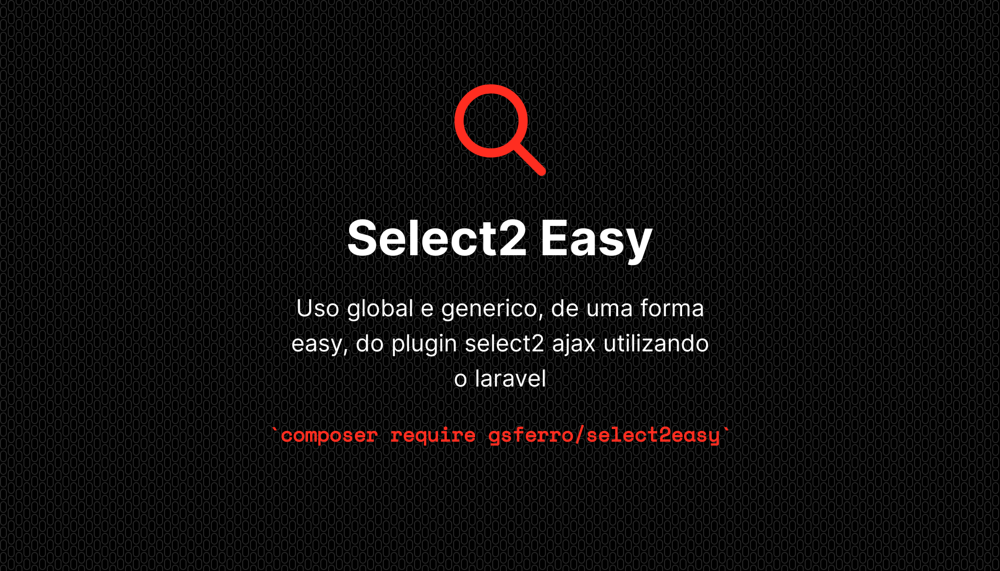

<p align="center">
    
    <p align="center">
        <a href="https://packagist.org/packages/gsferro/filtereasy"></a>
        <a href="https://packagist.org/packages/gsferro/filtereasy"></a>
        <a href="https://packagist.org/packages/gsferro/filtereasy"></a>
    </p>
</p>

------
### Instalação:

```shell 
composer require gsferro/select2easy -W
```

### Pacotes Dependências:
Package | Versão
--------|-----------
jquery | ^3.*
Select2 | ^4.0.13

### Publish
```composer 
php artisan vendor:publish --provider="Gsferro\Select2Easy\Providers\Select2EasyServiceProvider" --force
```

### Config
- Diretrivas blade, Coloque as no seu arquivo de layout    
  ``` php
  @select2easyCss()
  @select2easyJs()
  ```

- Caso utilize framework bootstrap 5:
  ``` php
  @Select2easyThemeBootstrap5()
  ```
  - Mude ou na instancia do plugin ou diretamente no `public/vendor/select2easy/js/select2easy.js`:
     ``` javascript
        $('#exemple').select2easy({
         theme: 'bootstrap-5',
       });
    ```
  - É necesário fazer um ajuste no css para quando o select2 estiver `disabled`
    ```css
    /* select2 disabled */
    .select2-container--bootstrap-5.select2-container--disabled .select2-selection,
    .select2-container--bootstrap-5.select2-container--disabled .select2-selection__placeholder,
    .select2-container--bootstrap-5.select2-container--disabled .select2-selection__rendered,
    .select2-container--bootstrap-5.select2-container--disabled.select2-container--focus .select2-selection
    {
        /* coloque a var conforme seu template ou set  #232e3c para thema dark e #edf2f9 para thema light*/ 
        background-color: var(--falcon-gray-200) !important; 
        opacity: 1;
    }
    ```
  
### Uso

- Você pode implementar quantos metodos quiser, para chamar a modelo em varias ocaciões dentro do projeto
    Ex: Model User.
    
    - `sl2Nome`: usando o nome como busca
    - `sl2Email`: usando o nome como busca
    - `sl2Login`: usando o nome como login

- Implemente na model a trait Select2Easy
- Crie uma stact function `Sl2<NomeMetodo>` que sera chamado na implementação em `data-sl2_method` ou `{ sl2_method : ""}`
    

- Na View:
    - no select coloque a class select2Easy (required)
    * coloque o attributo data-sl2_method = "nomeDoMetodoEstaticoDaModel" 
    * coloque o attributo data-sl2_model = 'caminho\para\Model'
    *  ou coloque o attributo data-sl2_hash = "{{ Crypt::encryptString('caminho\para\Model') }}"
    - Exemplo:
    ```html
    <label for="select2easy">Select2 Easy:</label>
    <select id="select2easy" name="select2easy" class="form-control select2easy"
        data-sl2_method="sl2"
        data-sl2_hash="{{ Crypt::encryptString('App\Models\Teams') }}" <!-- recommend -->
        <!-- ou -->
        data-sl2_model="App\Models\Teams"
  
        data-minimumInputLength=2
        data-delay=1000
    >
    </select>
    ```
    
- Instancie o plugin no select2easy

    ``` javascript    
    <script type="text/javascript">
        $( function() {
            $( '#select2easy' ).select2easy( {
                // select2
                // minimumInputLength : 2 ,
    
                // ajax
                // delay : 1000 ,
    
                // select2eay server side
                // sl2_method : 'string Method' ,
                // sl2_hash   : 'Crypt::encryptString('App\Models\Teams')' , // recommend
                
                // ou
                // sl2_model : 'App\Models\Teams' ,
            } );
        } )
    </script>
    ```    
- Model        
    * import usando: ```use Gsferro\Select2Easy\Http\Traits\Select2Easy```
    * Coloque  a trait ```Select2Easy```
    * crie o `nomeDoMetodoEstaticoDaModel` passando o term e page
    - Exemplo:

    ``` php
    <?php
        use Gsferro\Select2Easy\Http\Traits\Select2Easy
        
        class Teams extends Model
        {
            use Select2Easy;
      
            public static function sl2Name(string $term, int $page, string $parentId = null ) // nome usado na view
            {
                /*
                |---------------------------------------------------
                | Required
                |---------------------------------------------------
                |
                | $select2Search - colum from search
                | $select2Text - colum from write selectbox
                |
                */
                $select2Search = [
                    "name",
                    // with relation
                    'relation.title'
                ];
        
                // required
                $select2Text = "name";
                
                /*
                |---------------------------------------------------
                | Optional exemple
                |---------------------------------------------------
                |
                | $limitPage - limit view selectbox, default 6
                | $extraScopes - array with scopes
                | $prefix - prefix for before $select2Text
                | $scopeParentAndId - array with scope parent and id
                |
                */
                $limitPage   = 10; // default 6
                $extraScopes = ["active"] // scope previously declared 
                $prefix      = 'otherRelation.description';
                $scopeParentAndId = [
                  'scope' => $parentId,
                ];
                
               return self::select2easy(
                  $term,
                  $page,
                  $select2Search,
                  $select2Text,
                  $limitPage = 6,
                  $extraScopes = [],
                  $prefix = null,
                  $scopeParentAndId
              );
            }
        }
    ```    

### Cascade (select2 parents/dependent)

Tem momentos que é necessário que um select seja dependente de outro para poder exibir os dados pré filtrados, por 
exemplo `Estado > Cidades`. Para tal, basta colocar o atributo `data-sl2_child` no select2 `pai` (*parent*) o 
`id` do select2 do`filho` (*child*):
  - Exemplo:////////////////////////////////////////////////////////////////
    ```html
    <select id="parent"
        ...
        data-sl2_child="#children" 
    >
    </select>
    ```
  - Na model: É necessário ter o scope do `pai` e ser inicializado o array `$scopeParentAndId` contendo como chave o 
    scope e o value o paramentro `$parentId`, e passar para o  `self::select2easy`, exemplo:
     ```php
    public static function sl2Name(string $term, int $page, string $parentId)
    {
        $select2Search = [
        "name",
        ];
        $select2Text = "name";
        $scopeParentAndId = [
            'parent' => $parentId,
        ];

        return self::select2easy(
            $term,
            $page,
            $select2Search,
            $select2Text,
            $limitPage = 6,
            $extraScopes = [],
            $prefix = null,
            $scopeParentAndId
        );
    }
    ```

    - Caso vc esteja usando as versões do `php` >8, pode utilizar o `Named Arguments`:
     ```php
    public static function sl2Name(string $term, int $page, string $parentId)
    {
        $select2Search = [
        "name",
        ];
        $select2Text = "name";
        $scopeParentAndId = [
            'parent' => $parentId,
        ];

        return self::select2easy(
            term: $term,
            page: $page,
            select2Search: $select2Search,
            select2Text: $select2Text,
            scopeParentAndId: $scopeParentAndId
        );
    }
    ```
  
    - Inspirado neste javascript [select2-cascade.js](https://gist.github.com/ajaxray/187e7c9a00666a7ffff52a8a69b8bf31) 

### Selected

- Links do plugin
    - https://select2.org/data-sources/ajax#default-pre-selected-values
    - https://select2.org/programmatic-control/add-select-clear-items

- melhor opção:
```html
<select id="select2easy" name="select2easy" class="form-control select2easy"
      data-sl2_method="sl2"
      data-sl2_hash="{{ Crypt::encryptString('App\Models\Teams') }}" <!-- recommend -->
>
    <option value="{{ $model->teams_id }}" selected>{{ \App\Models\Teams::find($model->teams_id)->name }}</option>
    <!-- ou usar via relacionamento (se não for 1xN ou NxN -->
    <option value="{{ $model->teams->id }}" selected>{{ $model->teams->name }}</option>
    <!-- prefix -->
    <option value="{{ $model->teams->id }}" selected>{{ $model->teams->id }} - {{ $model->teams->name }}</option>
</select>
```

### Para versões do Laravel > 7

Como a ideia, pelo menos nas versões `v1.*` do pacote, é manter a compatiblidade com todas as versões do `Laravel`, 
desde a `L5` até a atual `L11`, não esta disponivel um *component*, mas fica aqui uma sugestão e possivel 
disponibilzação para as proximas versões de um *component* completamente funcional (baseado no `bootstrap 5`):

- Crie, caso não exista: `resources/views/components/forms/label.blade.php`
    ```php
        @props([
            'label',
            'isRequired' => false,
        ])
        <label  {{ $attributes->merge([ 'class' => 'form-label' ])->whereDoesntStartWith('label') }}>
            {{ $label }} {{ $isRequired ? '*' : '' }}
        </label>
    ```

  - Crie: `resources/views/components/select2/easy.blade.php`
      ```php
      @props([
          'name',
          'groupClass',
          'appModel',
          'col' => 12,
          'colMd' => 4,
          'id'    => null,
          'sl2'    => 'sl2Name',
          'label' => null,
      ])
    
      @section('vendor-styles')
          @once
              @select2easyCss()
              <link href="{{ asset('vendor/select2easy/select2/css/select2-bootstrap.css') }}" rel='stylesheet'
                    type='text/css'>
          @endonce
      @endsection
    
      @php
          $id = $id ?? $name;
      @endphp
    
      <div class="col-{{ $col }} col-md-{{ $colMd }} {{ $groupClass ?? '' }}">
          @if($label)
              <x-forms.label
                      for="{{ $id }}"
                      class="{{ $labelClass ?? '' }}"
                      :label="$label"
                      :isRequired="$attributes->offsetExists('required')"
              />
          @endif
          <select
                  name="{{ $name }}"
                  id="{{ $id }}"
                  data-sl2_method="{{ $sl2 }}"
                  data-sl2_hash="{{ Crypt::encryptString($appModel) }}"
                  {{ $attributes
                      ->merge(['class' => 'form-control select2easy'])
                      ->whereDoesntStartWith('col')
                  }}
        >
              {{ $slot }}
          </select>
      </div>
    
      @push('js')
          <script type="text/javascript">
              $(() => {
                  $('#{{$id}}').select2easy({
                      theme: 'bootstrap-5',
                  });
              });
          </script>
      @endpush
      ```
- Recomendo criar novos components encapsulando-do, Exemplo de uso:
     - `resources/views/components/select2/category.blade.php`
    ```php
    @props([
        'col',
        'sl2' => null,
        'value' => null,
        'name' => null,
        'useRequest' => null,
    ])
    
    @php
        $name = $name ?? 'category_id';
        $value = isset($useRequest)
            ? app('request')->input($name)
            : $value;
    
        $appModel = '\App\Models\Category';
    @endphp
    
    <x-select2.easy
        :col="$col ?? '12'"
        :col-md="$colMd ?? '4'"
        label="Categoria"
        :name="$name"
        :sl2="$sl2"
        :app-model="$appModel"
        {{ $attributes }}
    >
        @if (!empty($value))
            <option value="{{ $value }}">
                {{ $appModel::find($value)->name }}
            </option>
        @endif
    </x-select2.easy>
    ```
  - No formulário:
    ```php
    # usando request para pegar o value (filtro e etc)
    <x-select2.category useRequest data-sl2_child="#subcategory_id"/>
    # no form de create/edit
    <x-select2.category :value="old('category_id', $model->category_id)"  data-sl2_child="#subcategory_id" required />
    ```


### License
Laravel Localization is an open-sourced laravel package licensed under the MIT license